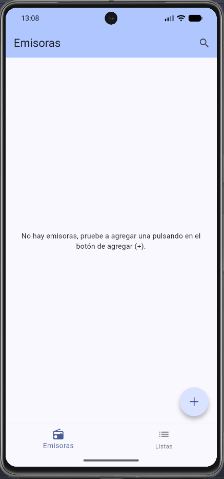
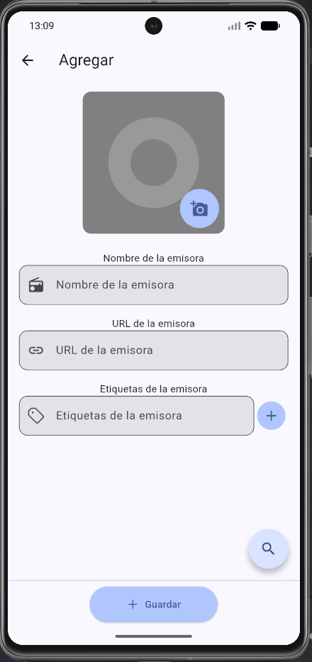
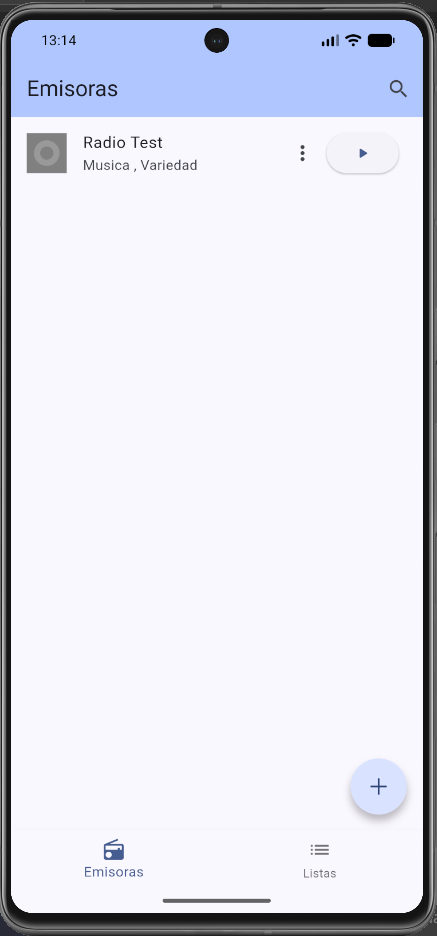
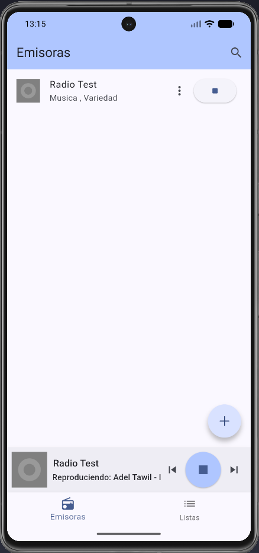
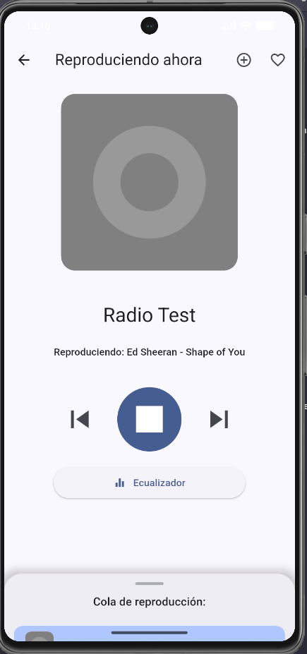
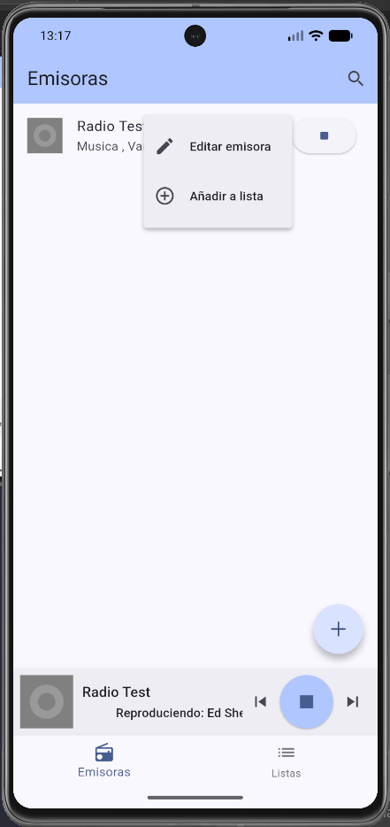
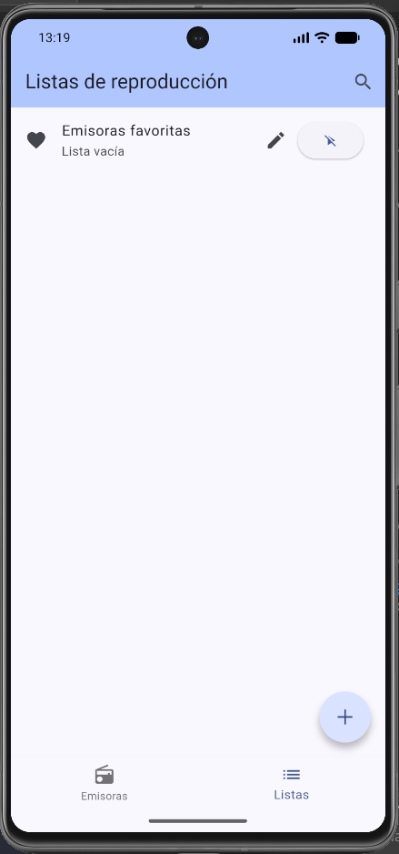
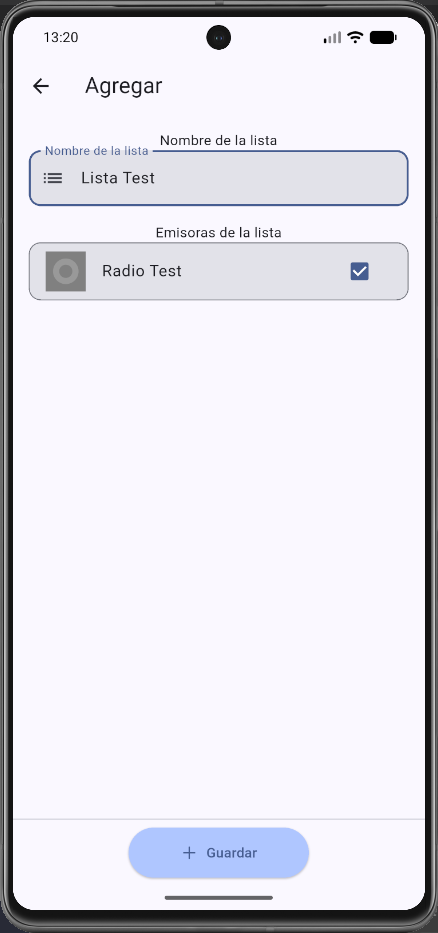
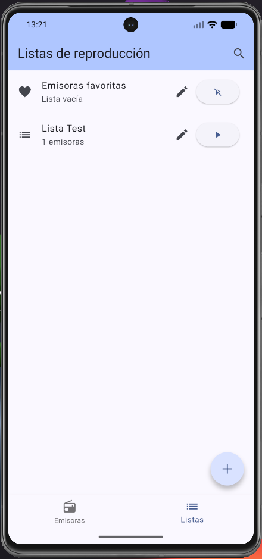
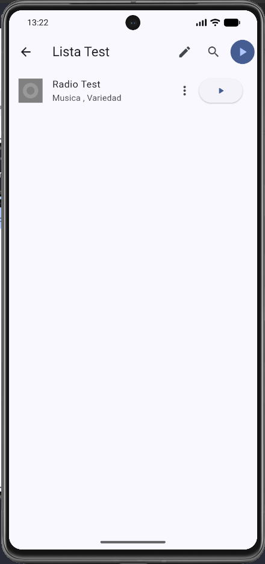

# OpenWave

OpenWave es un cliente de radio por streaming para dispositivos móviles Android.

## Instalación

Para instalar OpenWave, vaya al apartado de <a href="https://github.com/jcv00036/OpenWave/releases">releases</a> y descargue el fichero instalable de la última versión.

Una vez instalado el paquete, no será necesario ningún paso más.

## Instrucciones de uso básicas

1. Para añadir una emisora: solo será necesario pulsar en el botón de añadir (+) y rellenar el formulario de información de la nueva emisora o buscarla en el botón de buscar de la pantalla emergente.

2. Tras añadir una emisora, esta aparecerá en la pantalla principal. Para reproducirla, solo será necesario pulsar sobre ella o sobre el botón de play.

3. Para editar o eliminar una emisora, solo será necesario mantener pulsada sobre ella o sobre el botón de opciones.

4. Para añadir una lista de reproducción, solo será necesario pulsar en el botón de añadir (+) en la sección de listas de reproducción y rellenar el formulario de información de la nueva lista.

5. Para reproducir una lista de reproducción, solo será necesario pulsar sobre el botón de play o, dentro de la lista, sobre el botón de play de cada emisora o el de la barra de herramientas.

6. Para editar o eliminar una lista de reproducción, solo será necesario pulsar sobre su botón de editar. Allí podrás añadir nuevas emisoras.
7. Otras formas de añadir emisoras es: dentro de la vista de reproducción o pulsando en el menú de opciones de una emisora.

> La lista de favoritos es especial. Las emisoras pueden ser añadidas a esta lista pulsando el botón de favoritos (un corazón) que aparece al reproducirlas y editarlas.